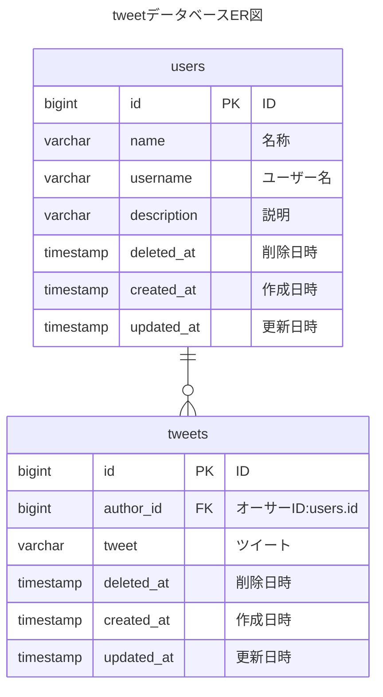

# 使用技術


[](https://www.debian.org/doc/manuals/debian-reference/ch01.ja.html)


📌このリポジトリはオリジナルのリポジトリからフォークしたものです。従って、時折[フォーク元](https://github.com/sho55/php83-nginx-mariadb)を確認することを推奨します。  

📌上のバッジ「GNU/Linux」をクリックすると何が起きるでしょう？

# Laravelプロジェクトの作成方法

1. **cloneする。**  
   プロジェクトのコピーを自分のコンピュータにダウンロードします。
   ```
   git clone https://github.com/sho55/php83-nginx-mariadb.git 
   ```

2. **docker composeで立ち上げる。**  
   ダウンロードしたプロジェクトを使って、必要なプログラム（コンテナと呼ばれる）を自動的に起動します。  

   📍前提 アプリ「Docker Desktop」が起動していることが必要です。 

   ※ Macに限られますが、従来の「Docker Desktop」に代わる代替アプリとして「OrbStack」があります。  
   📍「[OrbStack](https://orbstack.dev/)（オーブスタック）」は、超軽量・高速性能が注目されています。-> [参考サイト](https://qiita.com/shota0616/items/5b5b74d72272627e0f5a)

   ```bash
   #docker-compose.ymlが在るプロジェクトディレクトリに移動
   $ cd php83-nginx-mariadb

   # コンテナの起動
   $ docker compose up -d
   ```

3. **myapp-phpコンテナに入る**  
   「myapp-php」とは、前項で起動した３つのコンテナ名の一つで、  
   主にPHPプログラムの開発・実行を担当します。下記のコマンドを実行すると、そのコンテナに入ってbashシェルにより対話的に開発作業ができるモードになります。  
   このモードから抜けには```exit↵```と打ちます。
   
   ```bash
   # macターミナルからmyapp-phpコンテナに入る
   $ pwd
   ~/s/l/php83-nginx-mariadb #現在値を表示
   # -it:対話モード myapp-php:コンテナ名 bash:コンテナ内のシェル
   $ docker exec -it myapp-php bash
   ```
   下記は、app-phpコンテナの中に入ってbashシェルと対話している状態
   ```
   root@0a88bc8e521f:/var/www# 
   ```

4. **laravelをインストール**  
   PHPを使って、Laravelというツールをセットアップ（インストール）します。
   ```
   root@0a88bc8e521f:/var/www# composer create-project --prefer-dist laravel/laravel my-app
   ```

5. **phpコンテナから出る**  
   Laravelのセットアップが終わったら、PHPの部分を終了します。
   ```
   root@0a88bc8e521f:/var/www# exit
   ```

6. **docker-compose.ymlを編集する**  
   設定ファイル（docker-compose.yml）を変更して、プロジェクトの設定を更新します。以下のように`volumes`セクションを編集してください。  
   （凡例　　- - ;変更前の行　　+ - :変更後の行）

   ```
     web: 
    
       volumes:
       - - .:/var/www/
       + - ./my-app:/var/www/

     nginx: 
    
       volumes:
       - - .:/var/www/
       + - ./my-app:/var/www/
    
   ```

7. **再度docker composeで立ち上げる**  
   更新した設定で、もう一度プログラムを起動します。
   ```
   $ docker compose up -d
   ```
8. **/my-app/.envファイルを修正する**

   ```
     # アプリ名
       - - APP_NAME=Laravel
       + - APP_NAME=CoffeeReview
   
      # タイムゾーン
       - - APP_TIMEZONE=UTC
       + - APP_TIMEZONE=Asia/Tokyo

      # アプリのurl
       - - AAPP_URL=http://localhost
       + - APP_URL=http://localhost:81

      # 文字コード
       - - APP_LOCALE=en
       - - APP_FALLBACK_LOCALE=en
       - - APP_FAKER_LOCALE=en_US
       - + APP_LOCALE=ja
       - + APP_FALLBACK_LOCALE=ja
       - + APP_FAKER_LOCALE=ja_JP

      # ログの取得形式
       - - LOG_CHANNEL=stack
       - + LOG_CHANNEL=daily
   ```

9. **ブラウザで確認する**

[localhost:81](http://localhost:81/)


10. **Inertia（イナーシャ）のセットアップによる認証機能の実装**

Inertiaのもともとの意味；Inertia ＝　慣性  
詳しいセットアップ方法は[この動画](https://www.youtube.com/watch?v=humnThHNjLU&t=1201s)を参照する。

``` bash
# 下記コマンドでコンテナの中に入ってコマンド操作をやれるようにする
docker exec -it myapp-php bash

# コンテナmyapp-phpの中で下記コマンドを打つ
root@0a88bc8e521f:/var/www# composer require laravel/breeze --dev

# 続けて下記コマンドでreactを使うことを宣言する
root@0a88bc8e521f:/var/www# php artisan breeze:install react

```
**10.1 Inertiaの実装を確認する**

   1. VSCodeで⌘+p（⌘とｐキーの同時押し）でファイルapp.blade.phpを検索する  
      📍my-app/resource/views/ディレクトリに見つかるので、該当行をクリックして開く
      
   3. my-app/resource/views/app.blade.phpファイルの中に下記の行があることを確認する

   ```php
         (略）
        @routes
        @viteReactRefresh
        @vite(['resources/js/app.jsx', "resources/js/Pages/{$page['component']}.jsx"])
        @inertiaHead
      </head>
      <body class="font-sans antialiased">
        @inertia
      </body>
      （略）
   ```
   3. my-app/resources/js/Pages/Sample.jsxファイルを作成する
   ```jsx
      import { useEffect } from 'react';
      
      const Sample = () => {
         useEffect(() => {
            console.log('Component mounted');
            return () => {
               console.log('Component unmounted');
            };
         }, []);
      
         return (
            <>
            <div className='flex justify-center items-center h-screen bg-gray-300'>
               <div className="p-4 flex flex-col justify-center items-center bg-white shadow-lg">
                  <h1 className="text-2xl font-bold text-green-800">これはサンプルです</h1>
                  <p className='text-pink-500 text-lg font-bold'>バッチリ、tailwindcssが使えてるよ！</p>
               </div>
            </div>
            </>
         )
      }
      export default Sample;
   ```
   4. my-app/routes/web.phpを編集
      27行目に下記コードを挿入
   ```php
   Route::get('/sample', function () {
    return Inertia::render('Sample');
   })->name('sample');
   ```
   5. インスタンスmyapp-phpの中に入ってbashシェルを操作できるようにする
   ```bash
   ~/s/l/php83-nginx-mariadb $ docker exec -it myapp-php bash 

   # bashに入るとプロンプトが変わる
   root@0a88bc8e521f:/var/www# 

   # データベーステーブルshops（必ず複数形）の作成準備のためのマイグレーションファイルを作る
   root@0a88bc8e521f:/var/www# php artisan make:migration create_shops_table

   INFO  Migration [database/migrations/2025_01_28_095502_create_shops_table.php] created successfully.  
   ```
   6. 下記の部分を「⌘+ダブルクリック」してマイグレーションファイルを開く  
      ``` [database/migrations/2025_01_28_095502_create_shops_table.php]  ```
      
      ✅️開いたマイグレーションファイルの7行目以降を下記コードに書き換える  
   ```php
   return new class extends Migration
   {
      /**
      * Run the migrations.
      */
      public function up(): void
      {
         Schema::create('shops', function (Blueprint $table) {
               $table->id();
               $table->string('name');
               $table->string('location');
               $table->text('description')->nullable();
               $table->timestamps();
         });
      }

      /**
      * Reverse the migrations.
      */
      public function down(): void
      {
         Schema::dropIfExists('shops');
      }
   };
   ```

**10.2 vite設定ファイルmy-app/vite.config.jsを整える**

###  ER図の事例

#### tweetデータベース




